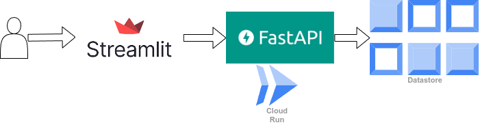

## 仕様書

### アプリ概要
- Streamlit フロントエンド + FastAPI バックエンド構成
- テレビ番組の検索、レビュー投稿、お気に入り管理、Google OAuth ログインなどを実装
## Architecture

### フロントエンド (Streamlit)
1. **起動方法**  
   - `streamlit run app.py`
2. **主な機能**  
   - Google ログイン：OAuth で認証  
   - 番組検索：検索キーワードで結果を表示  
   - レビュー投稿：ログインユーザーが評価・コメントを投稿  
   - お気に入り登録：ログインユーザーが番組を登録  
   - お気に入り・レビュー一覧表示

### バックエンド (FastAPI)
- `/search`：番組検索
- `/reviews`：レビュー投稿
- `/reviews/program/{program_id}`：レビュー取得
- `/favorites/{user_id}/{program_id}`：お気に入り登録
- `/favorites/{user_id}`：お気に入り一覧取得
- `/recommendations/{user_id}`：おすすめ番組取得

### データモデル (Datastore)
- **User**:
  - `user_id`
  - `user_name`
- **Review**:
  - `review_id`
  - `program_id`
  - `user_id`
  - `rating`
  - `review_text`
  - `created_at`
- **Favorite**:
  - `user_id` (親 Key)
  - `program_id` (子 Key)